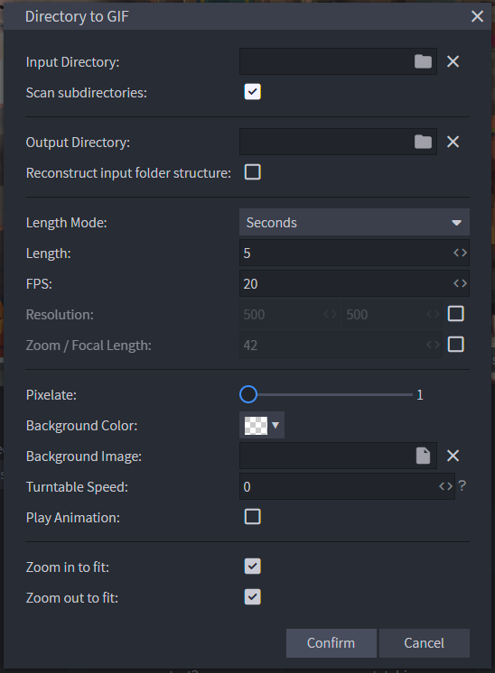

# Blockbench Directory to GIF

#### Usage
- Download plugin file [directory_to_gif.js](directory_to_gif.js "download") and install
- Open Blockbench
    - You don't need to open any models, but you can if you want to resize the viewport or reposition the model
- Press F3 to open action control
- Type "gif" and select "Directory to GIF"

